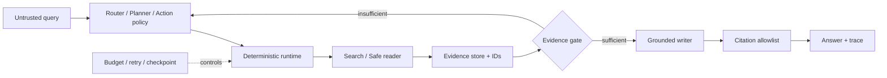

# DeepTrace-R1

[简体中文](README.md) · [Agent architecture](docs/architecture.md) · [Training and evaluation](docs/training-and-evaluation.md) · [Security](docs/security.md)

DeepTrace-R1 is an evidence-grounded deep-research agent with inspectable tool traces, a deterministic runtime, trajectory SFT, independent evaluation, and a bilingual web workbench.

The repository includes:

- hybrid retrieval and grounded RAG: BM25, BGE-M3 dense retrieval, RRF and an optional BGE reranker;
- a Python research runtime: scope, planning, supervisor/research units, evidence gates, budgets, checkpoints, cancel and resume;
- an action-training pipeline: DeepSeek teacher trajectories, quality filters and Qwen3-8B LoRA SFT;
- Base-vs-SFT tool-loop evaluation with answer, evidence and protocol metrics;
- a bilingual Cloudflare Worker site that streams real stage INPUT/OUTPUT over SSE and persists runs in D1.

## Reported result

The frozen 90-question evaluation uses 30 questions each from HotpotQA, 2WikiMultiHopQA and MuSiQue with a controlled evidence pool and a fixed tool budget.

| Metric | Base Qwen3-8B | SFT Agent |
|---|---:|---:|
| Answer EM | 8.89% | **55.56%** |
| Answer F1 | 9.75% | **66.73%** |
| Tool-loop completion | 15.56% | **100.00%** |
| Gold evidence recall | 25.28% | **57.22%** |
| Invalid actions | 19 | **0** |
| Final protocol failures | 65 | **0** |

This is a controlled tool-policy evaluation, not an open-web SOTA claim. See the Chinese README and dataset manifests for the truth boundary and source revisions.

## Architecture



The model proposes actions; the runtime authorizes them. Search results do not become citable until they are successfully read, and an answer may cite only evidence IDs admitted by the current run.

## Quick start

Requirements: Python 3.11+, Node.js 22.13+, pnpm 11.16+. GPU is optional for unit tests and BM25 but required for local Qwen3-8B training/inference.

```bash
git clone https://github.com/yzl0ng/deeptrace.git
cd deeptrace
python -m venv .venv
source .venv/bin/activate
python -m pip install -e ".[dev,data]"
python -m pytest
python -m uvicorn app.main:app --host 127.0.0.1 --port 8000
```

Enable the Python agent runtime:

```bash
export DEEPTRACE_ENABLED=true
export DEEPTRACE_WORKFLOW=supervisor
export DEEPTRACE_SEARCH_PROVIDER=local
export DEEPSEEK_API_KEY="your-key"
export DEEPSEEK_MODEL="deepseek-v4-flash"
python -m uvicorn app.main:app --host 127.0.0.1 --port 8000
```

Create a run:

```bash
curl -X POST http://127.0.0.1:8000/api/v2/research/runs \
  -H "content-type: application/json" \
  -d '{"query":"Why do BM25 and dense retrieval complement each other?"}'
```

Run the web workbench:

```bash
cd apps/web
cp .env.example .env
pnpm install --frozen-lockfile
pnpm dev
```

Static architecture, training and evaluation pages work without credentials. Live mode requires `DEEPSEEK_API_KEY`, `LIVE_DEMO_ACCESS_TOKEN` and the D1 binding named `DB`.

## Training

The public pipeline is:

```text
pinned multi-hop seeds
→ DeepSeek teacher trajectories
→ schema/evidence/action quality filtering
→ veRL multi-turn parquet
→ Qwen3-8B LoRA SFT
→ adapter export
→ frozen Base-vs-SFT tool-loop evaluation
```

Representative commands:

```bash
python scripts/prepare_trajectory_seed_pool.py \
  --output-dir work/trajectory-seeds --limit 500

python scripts/prepare_action_sft_dataset.py \
  --input-dir work/trajectory-500 \
  --output-dir work/sft-action-500 \
  --dataset-version sft-action-500-public

export DEEPTRACE_TASK_ROOT=/data/$USER/deeptrace-r1
export DEEPTRACE_PROJECT_ROOT=$PWD
export DEEPTRACE_PYTHON=/path/to/python
export DEEPTRACE_VERL_ROOT=/path/to/verl
bash scripts/run_sft_epoch_when_gpus_free.sh
```

The scheduler selects any two GPUs meeting its free-memory threshold; it does not pin specific GPU indices. Models, checkpoints and adapters live outside Git.

Evaluate Base and LoRA through the same runtime protocol:

```bash
python scripts/evaluate_lora_tool_loop.py \
  --base-model /models/Qwen3-8B \
  --adapter /adapters/deeptrace-student \
  --cases data/evaluation/final-tool-loop-test-v1/test-distractor.jsonl \
  --output-dir outputs/final-tool-loop \
  --max-steps 8 \
  --modes base sft
```

For every script, use `python scripts/<script>.py --help` and preserve input revisions, seeds, manifests and hashes with the experiment.

## Runtime surfaces

The project intentionally has two deployment surfaces:

1. The Python FastAPI runtime implements the complete retrieval, RAG, supervisor, local/Brave search and SQLite checkpoint pipeline.
2. The independent web Worker implements a deployable DeepSeek action loop over a pinned BM25 corpus, streams SSE traces, and stores runs in D1.

They share the typed-action and evidence-allowlist design, but the web live demo is not a proxy for the Python service.

## License and data

Project code is Apache-2.0. Third-party components and pinned revisions are recorded in `THIRD_PARTY.md` and `upstream.lock.yaml`. Derived benchmark records retain their upstream licenses. Model weights, adapters, credentials and private infrastructure are not distributed by this repository.

See [README.md](README.md) for the complete module-by-module guide and Windows commands.
