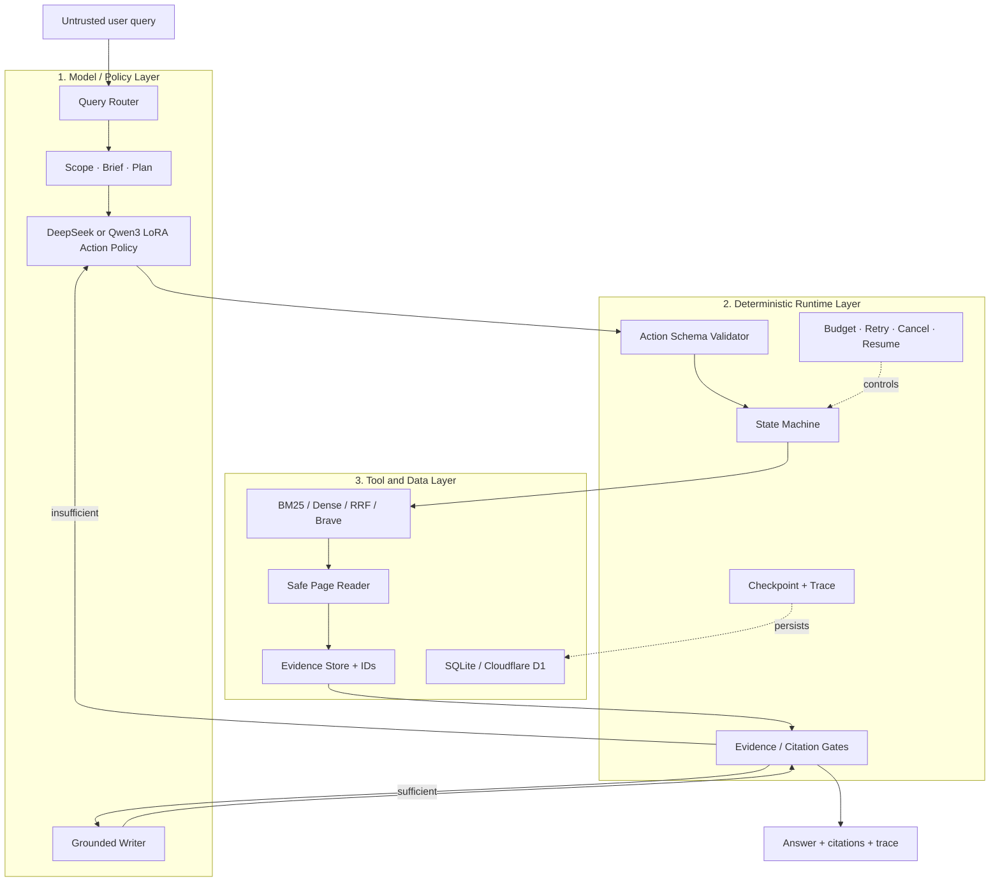

# DeepTrace-R1

[English](README.en.md) · [Agent 架构](docs/architecture.md) · [训练与评测](docs/training-and-evaluation.md) · [安全与公开边界](docs/security.md)

DeepTrace-R1 是一个**证据约束、轨迹可观察、可训练和可评测的 Deep Research Agent**。项目不是只展示最终答案，而是把问题路由、规划、工具动作、证据读取、充分性检查、引用白名单、预算、恢复和最终写作都作为可检查的工程状态。

仓库包含四部分：

- Python 检索与 Grounded RAG：BM25、BGE-M3 Dense Retrieval、RRF、可选 BGE Reranker、文档入库与引用回答；
- Python Agent Runtime：DeepSeek Planner/Writer、Supervisor、Research Units、Evidence Store、状态机、预算、取消与恢复；
- Agent 训练与评测：轨迹合成、质量过滤、Qwen3-8B LoRA SFT、Base/SFT 固定工具循环对比；
- 中英文网页：架构、训练、评测和基础设施页面，以及可展开真实 INPUT/OUTPUT 的 SSE 实时 Agent Workbench。

> 当前版本：`v0.3.0`。本仓库不包含模型权重、API Key、SSH 凭据、私有服务器地址和大型运行产物。

## 结果摘要

在冻结的 90 题独立评测集上，问题来自 HotpotQA、2WikiMultiHopQA 和 MuSiQue，每个来源 30 题。评测使用固定候选证据池和统一工具预算，比较 Base Qwen3-8B 与 LoRA SFT Agent。

| 指标 | Base Qwen3-8B | SFT Agent | 变化 |
|---|---:|---:|---:|
| Answer EM | 8.89% | **55.56%** | +46.67 pp |
| Answer F1 | 9.75% | **66.73%** | +56.98 pp |
| 工具链完成率 | 15.56% | **100.00%** | +84.44 pp |
| Gold evidence recall | 25.28% | **57.22%** | +31.94 pp |
| 非法 action | 19 | **0** | -19 |
| 最终协议失败 | 65 | **0** | -65 |

这些结果证明的是：约 500 条高质量 action trajectory 加上确定性 Runtime 协议，可以显著改善 8B 模型完成搜索、阅读、证据判断和回答工具循环的稳定性。它不等同于开放网络 SOTA：90 题测试使用受控 Gold evidence pool，不同公开工作的模型、语料库和预算也不一致。

## 仓库结构

```text
deeptrace-r1/
├── app/
│   ├── agentic/             # Agent Runtime、Supervisor、工具循环、证据与状态
│   ├── core/                # BM25、Dense、RRF、Reranker、RAG
│   ├── evaluation/          # 数据集、指标、失败分析与审计
│   ├── ingestion/           # 文档解析、切块与安全校验
│   ├── storage/             # SQLite 仓储
│   └── main.py              # FastAPI v1/v2 接口
├── apps/web/                # 中英文网站、SSE Workbench、Cloudflare Worker、D1
├── config/                  # 模型、训练栈和运行环境锁定信息
├── data/
│   ├── evaluation/          # 可公开的冻结小型评测集与来源信息
│   ├── fixtures/            # 离线网页证据测试夹具
│   ├── reports/             # 可复核的汇总结果
│   ├── training/            # 训练阶段 manifest/report，不含权重
│   └── sample_documents.jsonl
├── docs/                    # 架构、训练评测、安全与部署说明
├── scripts/                 # 数据、训练、评测、GPU 调度和验收脚本
├── tests/                   # Python 回归测试
├── .github/workflows/ci.yml
├── .env.example
├── LICENSE
└── THIRD_PARTY.md
```

## 三层 Agent 架构



核心原则是**模型负责选择，Runtime 负责授权**：

- 模型可以建议下一步 action，但不能直接执行任意代码或网络请求；
- Runtime 只接受定义好的 JSON Action Schema；
- `read_page` 只能读取本次 `search` 返回的 Evidence ID；
- `answer` 只能引用实际读过并通过门禁的 Evidence ID；
- 超时、步数、检索次数、页面读取数和 token 都由 Runtime 计数；
- 工具返回和网页内容始终被视为不可信证据，不能覆盖系统指令。

完整状态、动作和失败恢复见 [docs/architecture.md](docs/architecture.md)。

## 两条可运行链路

### A. Python 完整研究链路

适合开发 Runtime、检索、文档入库、Supervisor、取消恢复和端到端评测：

```text
FastAPI → DeepSeek research model → Supervisor → local/Brave tools
        → Evidence Store → SQLite checkpoints → grounded report
```

### B. 独立网页实时链路

适合公开演示和检查每一步真实返回：

```text
Browser → Cloudflare Worker → DeepSeek route/action/writer
        → pinned BM25 corpus → Runtime evidence gate → D1 + SSE
```

网页 Live 模式不是 Python API 的代理。它是一个可独立部署的 Worker Runtime，使用固定公开语料进行 BM25 检索；静态页面同时展示 Python Runtime、Student LoRA 和离线评测架构。两条链路共享相同的 action/evidence 协议思想，但部署边界不同。

## 快速开始

### 环境要求

- Python 3.11+
- Node.js 22.13+
- pnpm 11.16+
- 仅运行单元测试和本地 BM25 不需要 GPU；
- Dense/Reranker 首次运行会下载对应 Hugging Face 模型；
- Qwen3-8B LoRA 训练和本地 Student 推理需要 NVIDIA GPU；
- DeepSeek 实时运行需要自己的 `DEEPSEEK_API_KEY`。

### 1. 安装 Python 项目

```bash
git clone https://github.com/yzl0ng/deeptrace.git
cd deeptrace
python -m venv .venv
```

Linux/macOS：

```bash
source .venv/bin/activate
python -m pip install --upgrade pip
python -m pip install -e ".[dev,data]"
cp .env.example .env
```

Windows PowerShell：

```powershell
.\.venv\Scripts\Activate.ps1
python -m pip install --upgrade pip
python -m pip install -e ".[dev,data]"
Copy-Item .env.example .env
```

环境变量不会自动从 `.env` 注入；可以使用自己的进程管理器加载，或在终端中显式设置。

### 2. 启动检索与 RAG API

不启用 Agent 时可以直接启动 v1 检索服务：

```bash
python -m uvicorn app.main:app --host 127.0.0.1 --port 8000
```

检查状态：

```bash
curl http://127.0.0.1:8000/health
curl "http://127.0.0.1:8000/api/v1/search?q=BM25&top_k=5"
curl "http://127.0.0.1:8000/api/v1/search/hybrid?q=hybrid%20retrieval&top_k=5"
```

主要 v1 能力：

| 接口 | 用途 |
|---|---|
| `GET /api/v1/search` | BM25 检索 |
| `GET /api/v1/search/dense` | Dense Exact Retrieval |
| `GET /api/v1/search/hybrid` | BM25 + Dense + RRF |
| `POST /api/v1/rag/answer` | Grounded RAG |
| `POST /api/v1/rag/reranked-answer` | Reranker 后生成 |
| `POST /api/v1/documents` | 文档上传与入库 |
| `POST /api/v1/index/rebuild` | 重建索引 |

API 文档位于 `http://127.0.0.1:8000/docs`。

### 3. 启动 Python Agent Runtime

最小本地语料模式仍然需要 DeepSeek 做 scope、plan 和 writer，但搜索使用仓库内的 `data/sample_documents.jsonl`：

Linux/macOS：

```bash
export DEEPTRACE_ENABLED=true
export DEEPTRACE_WORKFLOW=supervisor
export DEEPTRACE_SEARCH_PROVIDER=local
export DEEPSEEK_API_KEY="your-key"
export DEEPSEEK_MODEL="deepseek-v4-flash"
python -m uvicorn app.main:app --host 127.0.0.1 --port 8000
```

Windows PowerShell：

```powershell
$env:DEEPTRACE_ENABLED = "true"
$env:DEEPTRACE_WORKFLOW = "supervisor"
$env:DEEPTRACE_SEARCH_PROVIDER = "local"
$env:DEEPSEEK_API_KEY = "your-key"
$env:DEEPSEEK_MODEL = "deepseek-v4-flash"
python -m uvicorn app.main:app --host 127.0.0.1 --port 8000
```

创建研究任务：

```bash
curl -X POST http://127.0.0.1:8000/api/v2/research/runs \
  -H "content-type: application/json" \
  -d '{"query":"Why do BM25 and dense retrieval complement each other?"}'
```

主要 v2 接口：

| 接口 | 用途 |
|---|---|
| `GET /api/v2/research/status` | 检查配置和预算 |
| `POST /api/v2/research/runs` | 创建 Research Run |
| `GET /api/v2/research/runs/{run_id}` | 查询状态、轨迹和报告 |
| `POST /api/v2/research/runs/{run_id}/cancel` | 请求取消 |
| `POST /api/v2/research/runs/{run_id}/resume` | 从 checkpoint 恢复 |

使用真实网页搜索时设置：

```bash
export DEEPTRACE_SEARCH_PROVIDER=brave
export BRAVE_SEARCH_API_KEY="your-key"
```

`SafePageReader` 会限制 URL、响应类型和正文提取；网页内容仍然属于不可信证据。

### 4. 启动中英文网页

```bash
cd apps/web
cp .env.example .env
pnpm install --frozen-lockfile
pnpm dev
```

打开开发服务器输出的地址。以下页面不需要模型 Key：

- `/`、`/zh`：项目首页和轨迹 Workbench；
- `/architecture`、`/zh/architecture`：三层架构；
- `/architecture/detail`：工程模块细节；
- `/training`、`/zh/training`：训练链路；
- `/evaluation`、`/zh/evaluation`：评测协议和结果；
- `/infrastructure`、`/zh/infrastructure`：本地、云端和 GPU 边界。

Live 模式需要在 `apps/web/.env` 设置：

```dotenv
DEEPSEEK_API_KEY=your-key
DEEPSEEK_BASE_URL=https://api.deepseek.com
DEEPSEEK_MODEL=deepseek-v4-flash
LIVE_DEMO_ACCESS_TOKEN=your-long-random-access-code
```

网页通过 SSE 展示每个 stage 的 actor、INPUT、RETURNED OUTPUT、token usage 和经过时间。运行记录持久化在 D1，而不是浏览器 `localStorage`。

### 5. 运行测试

Python：

```bash
python -m pytest
```

默认排除需要真实 BGE 缓存或外部 API 的 integration tests。运行指定集成测试：

```bash
python -m pytest -m integration
python -m pytest -m llm_integration
```

网页：

```bash
cd apps/web
pnpm test
pnpm lint
```

GitHub Actions 会分别运行 Python 测试和网页生产构建/契约测试。

## 训练流程


### 生成轨迹种子

```bash
python scripts/prepare_trajectory_seed_pool.py \
  --output-dir work/trajectory-seeds \
  --limit 500
```

### 使用 DeepSeek Teacher 生成与过滤轨迹

```bash
export DEEPSEEK_API_KEY="your-key"
python scripts/run_trajectory_pilot.py \
  --limit 500 \
  --workers 4 \
  --seed-file work/trajectory-seeds/seeds.jsonl \
  --trajectory-version trajectory-500-public \
  --output-dir work/trajectory-500

python scripts/audit_trajectory_quality.py \
  --raw work/trajectory-500/raw.jsonl \
  --seed-file work/trajectory-seeds/seeds.jsonl \
  --output-dir work/trajectory-500-audit
```

具体文件名可通过 `python scripts/<name>.py --help` 确认；每次实验应保存输入 revision、随机种子、过滤报告和 hash。

### 转换 Action SFT 数据

```bash
python scripts/prepare_action_sft_dataset.py \
  --input-dir work/trajectory-500 \
  --output-dir work/sft-action-500 \
  --dataset-version sft-action-500-public
```

验证 veRL Parquet：

```bash
python scripts/validate_sft_dataset.py \
  --model /models/Qwen3-8B \
  --train work/sft-action-500/train.parquet \
  --validation work/sft-action-500/validation.parquet \
  --max-length 2048 \
  --output work/sft-action-500/validation-report.json
```

### GPU 空闲时自动训练

训练脚本不会固定 GPU 4/5。它使用 `nvidia-smi` 选择满足显存阈值的两张空闲 GPU，并支持 checkpoint 恢复：

```bash
export DEEPTRACE_TASK_ROOT=/data/$USER/deeptrace-r1
export DEEPTRACE_PROJECT_ROOT=$PWD
export DEEPTRACE_PYTHON=/path/to/python
export DEEPTRACE_VERL_ROOT=/path/to/verl
export TASK_TOTAL_STEPS=210
export TASK_TOTAL_EPOCHS=1
bash scripts/run_sft_epoch_when_gpus_free.sh
```

这个脚本依赖 Linux、NVIDIA 驱动、PyTorch、veRL/FSDP2、`flock` 和两张可用 GPU。模型、数据集、checkpoint 与 adapter 路径位于 `DEEPTRACE_TASK_ROOT`，不会提交到 Git。

详细参数和目录契约见 [docs/training-and-evaluation.md](docs/training-and-evaluation.md)。

## 独立工具循环评测

使用冻结的测试集比较 Base 与 LoRA：

```bash
python scripts/evaluate_lora_tool_loop.py \
  --base-model /models/Qwen3-8B \
  --adapter /adapters/deeptrace-student \
  --cases data/evaluation/final-tool-loop-test-v1/test-distractor.jsonl \
  --output-dir outputs/final-tool-loop \
  --max-steps 8 \
  --modes base sft
```

评测不仅计算答案 EM/F1，还记录：

- 是否在最大步数内完成；
- 是否生成非法 action；
- 是否尝试未知 Evidence ID；
- 是否读取并引用有效证据；
- Gold evidence recall；
- 协议错误是否被恢复；
- 最终协议是否失败。

测试集来源、许可证、revision 和 SHA-256 位于 `data/evaluation/**/manifest.json`。测试集不能用于修改 prompt、阈值或模型参数。

## 端到端验收

后端和网页都启动后：

```bash
python scripts/run_v2_end_to_end_acceptance.py \
  --api-base http://127.0.0.1:8000 \
  --web-url http://127.0.0.1:3000 \
  --output-dir outputs/v2-acceptance
```

验收检查 API round-trip、状态机、工具记录、证据充分性、最终引用以及网页可见状态。输出目录被 Git 忽略。

## 数据、权重与许可证

- 项目代码：Apache-2.0，见 [LICENSE](LICENSE)；
- 第三方软件与固定 revision：见 [THIRD_PARTY.md](THIRD_PARTY.md) 和 [upstream.lock.yaml](upstream.lock.yaml)；
- HotpotQA 派生内容：CC BY-SA 4.0；
- 2WikiMultiHopQA 派生内容：Apache-2.0；
- MuSiQue 派生内容：CC BY 4.0；
- Qwen、BGE、DeepSeek、veRL 及其他模型/框架遵循各自许可证和服务条款；
- 本仓库不重新许可第三方数据，也不分发 Qwen3-8B Base 或 LoRA 权重。

## 安全规则

- 不要提交 `.env`、API Key、SSH Key、访问令牌或真实服务器地址；
- 不要把模型返回直接当作可执行工具参数；
- 任何 Evidence ID 必须由 Runtime 根据本次运行状态校验；
- 开放公网前应增加身份验证、按用户限流、成本上限和日志脱敏；
- 如果密钥曾进入 Git 历史，仅删除文件不够，必须撤销并重新签发密钥；
- D1/SQLite 中的 Query 与 Trace 可能包含用户隐私，应配置保留周期和删除策略。

更多说明见 [docs/security.md](docs/security.md)。

## 已知局限

1. 网页 Live Runtime 当前使用固定小型语料 BM25，不等于开放互联网搜索；
2. Python Brave 链路需要外部搜索 Key，网页漂移和抓取失败仍需生产监控；
3. 90 题独立评测是受控证据池，不能宣称统一设置下的 SOTA；
4. SFT Agent 的答案能力提升明显，但 57.22% Gold evidence recall 表明完整覆盖多跳证据仍是主要瓶颈；
5. GPU 训练脚本面向 Linux + NVIDIA + veRL 环境，需要使用者根据自己的存储和运行时设置根目录；
6. 模型输出属于概率性结果，Runtime 门禁降低协议错误，但不能保证事实永远正确。

## 贡献

欢迎提交 Issue 或 Pull Request。建议在 PR 中说明：

- 修改影响哪一层：Model、Runtime、Tool/Data 或 Web；
- 是否改变 action schema、预算、证据门禁或评测口径；
- 对应测试和复现实验命令；
- 新增数据、模型或代码的许可证来源。

发布安全问题时不要在公开 Issue 中粘贴真实密钥、用户 Query 或服务器信息。
