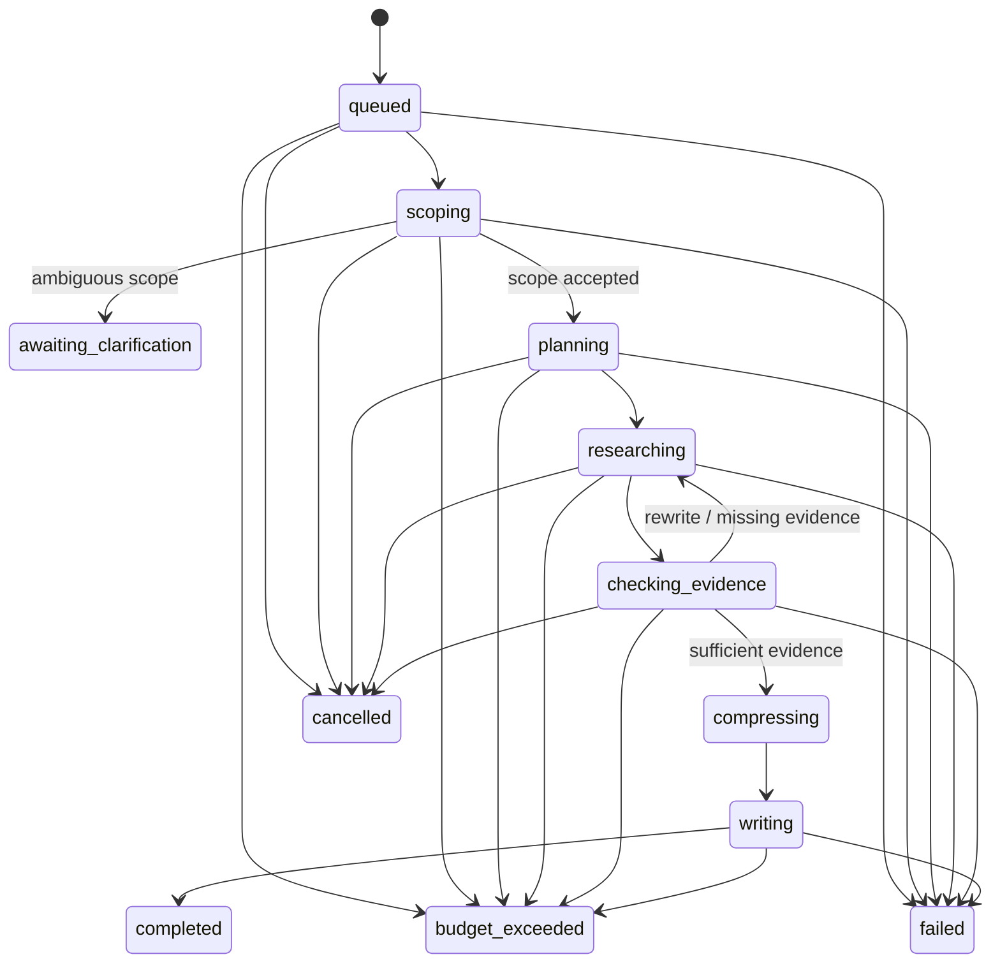
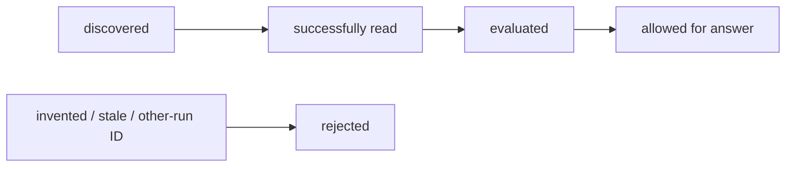
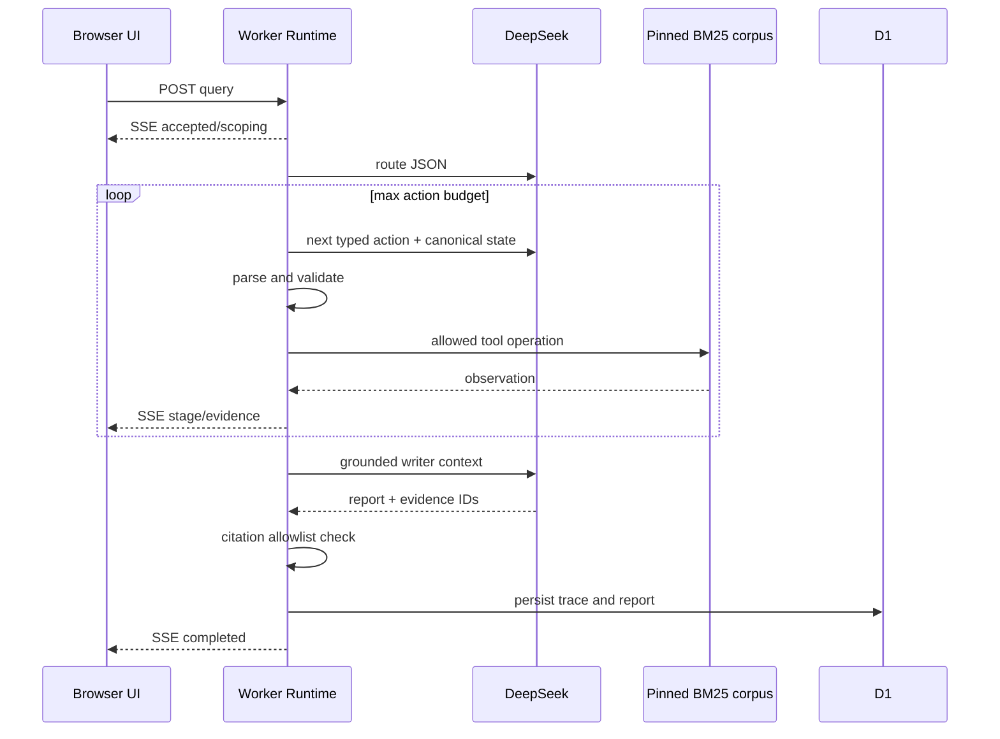

# DeepTrace Agent architecture

This document describes the executable boundaries of the Python Runtime and the independent web Worker. It distinguishes model decisions from deterministic authorization.

## Components

### Model/policy layer

- **Query route** chooses `direct_answer` or `evidence_research` in the web runtime.
- **Scope** returns a normalized research question and whether clarification is required in the Python runtime.
- **Brief and planner** turn the accepted question into bounded research subtasks.
- **Action policy** emits exactly one typed action at a time.
- **Grounded writer** receives only the accepted evidence context and produces the final report.

Model output is always parsed and validated. A provider response is not an action until the Runtime accepts its schema and current-state preconditions.

### Deterministic runtime layer

- owns the canonical run state;
- validates action names, arguments and evidence IDs;
- executes tools and records observations;
- enforces the evidence and answer gates;
- accounts for tokens, searches, reads, actions and wall time;
- persists checkpoints and supports cancellation/resume;
- refuses or safely degrades when model output is malformed.

### Tool/data layer

- BM25, BGE-M3 dense retrieval, RRF and optional cross-encoder reranking;
- local corpus or Brave search provider;
- Safe Page Reader;
- Evidence Store and immutable IDs within one run;
- SQLite for Python runs and Cloudflare D1 for web live runs.

## Python state machine



Canonical statuses are defined in `app/agentic/models.py`. The Supervisor stores checkpoints after completed stages so that resume does not repeat already accepted work.

## Typed action loop

The action contract is:

```json
{
  "rationale_summary": "short operational reason",
  "action": "search | read_page | evaluate_evidence | answer",
  "arguments": {},
  "evidence_ids": [],
  "final_answer": null
}
```

| Action | Model proposes | Runtime verifies | Observation |
|---|---|---|---|
| `search` | query | length, budget, provider | discovered Evidence IDs and scores |
| `read_page` | Evidence ID | ID was discovered in this run | sanitized content and source metadata |
| `evaluate_evidence` | Evidence IDs | IDs were successfully read | sufficiency/missing/conflict status |
| `answer` | answer and citations | evidence gate, allowlist, protocol order | accepted answer or recoverable failure |

The preferred order is `search → read_page → evaluate_evidence → answer`, but the Runtime—not the prompt—provides the guarantee.

## Evidence lifecycle



An ID is scoped to one run. Text appearing in a model response does not create an Evidence ID. The final citation list is intersected with the Runtime allowlist.

## Python Supervisor workflow

1. Create and persist a queued run.
2. Invoke scope; stop at `awaiting_clarification` when necessary.
3. Build a research brief and bounded subtask plan.
4. Execute research units with reserved search/page budgets.
5. Grade evidence and optionally rewrite missing queries.
6. Detect material contradictions.
7. Fold accepted observations into bounded memory.
8. Ask the writer for a report using allowed Evidence IDs.
9. Validate citations, persist the terminal run and expose the trace through the API.

## Independent web Worker

The web runtime uses a smaller action loop suitable for a public demo:



The UI renders actor, input and returned output from saved SSE events. Secret provider responses are not exposed beyond the structured public trace.

## Failure semantics

- malformed model JSON: retry when configured, otherwise safe failure/degradation;
- unknown Evidence ID: reject the action and preserve the attempt in the trace;
- insufficient evidence: block answer and return control to the policy while budget remains;
- budget exhaustion: terminal `budget_exceeded`, not a fabricated answer;
- tool failure: record a typed error; the Supervisor may continue or fail according to stage requirements;
- cancellation: persist `cancelled`; resume is allowed only through the Supervisor workflow.
